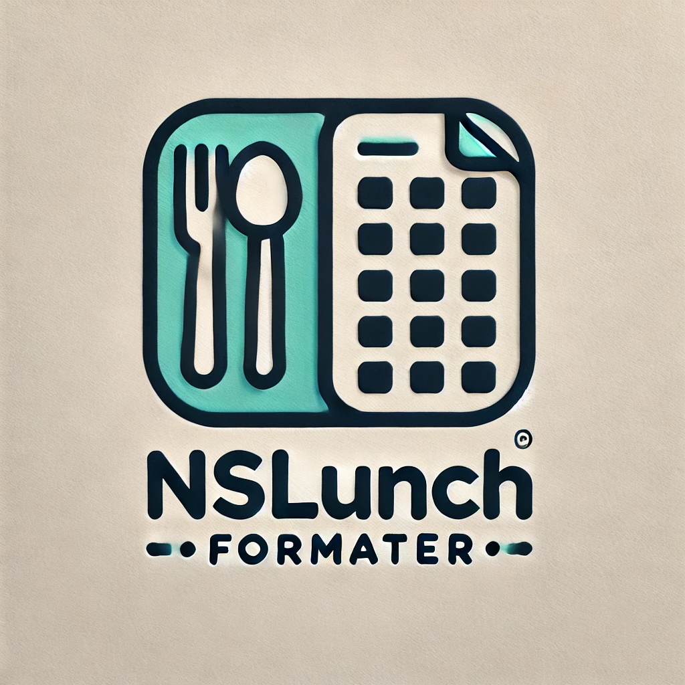

# Nova Scotia Lunch Formatter

This project helps schools convert CSV reports with student names and meals into
a consolidated list by meals and classes. The tool can export the consolidated
data to PDF format.

**Disclaimer: This project is not associated with NSLunch.ca.**

## Features

-   Convert CSV reports to a consolidated list by meals and classes.
-   Export the consolidated data to PDF format.
-   User-friendly interface with advanced options for customization.
-   Supports sorting by home room locations.
-   Provides detailed meal counts per class and location.
-   Generates color-coded PDF reports for easy visualization.
-   Ensures data privacy by processing files locally on the user's computer.

## Getting Started

### Prerequisites

-   A modern web browser (Chrome, Firefox, Edge, etc.)
-   Internet connection to load external libraries (XLSX and jsPDF)

### Installation

No installation is required. Simply open the web page in your browser.

### Usage

1. **Upload CSV File**: Click the "Choose File" button to upload your CSV file containing student names and meal information.
2. **Process File**: Click the "Process File" button to generate the consolidated report.
3. **Advanced Options**: Use the "Hide Advanced Options" checkbox to toggle advanced settings for customization.

### Purpose

The purpose of the Nova Scotia Lunch Formatter is to provide a user-friendly interface for
uploading CSV files containing student names and meal information, and to
process these files to generate a consolidated report in PDF format. This tool is designed to help schools efficiently manage and report meal distribution.

### Data Safety

This page doesn't upload information anywhere. It is safe to use and protects
the information. The information never leaves your computer. This is open source
and hosted on GitHub Pages publicly and can be verified that it's safe by any
tech-savvy person. However, it doesn't support password-protected files.

### Security Policy

If you discover any security vulnerabilities, please refer to our [Security Policy](SECURITY.md) for instructions on how to report them. This helps ensure that any security issues are addressed promptly and responsibly.

### Issues

If you have issues, you can report them by adding issues to this GitHub repo:
[NSLunchFormatter](https://github.com/Shereef/NSLunchFormatter/issues).

### License

This project is licensed under the MIT License - see the
[LICENSE.txt](LICENSE.txt) file for details.

### Contributing

Contributions are welcome! Please fork the repository and submit a pull request with your changes.

### Contact

For any inquiries, please contact [Shereef Marzouk](https://www.linkedin.com/in/shereef/).
